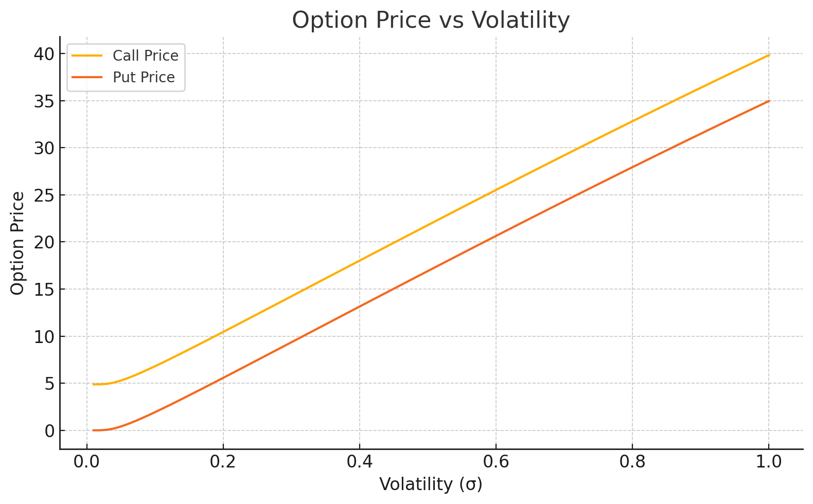
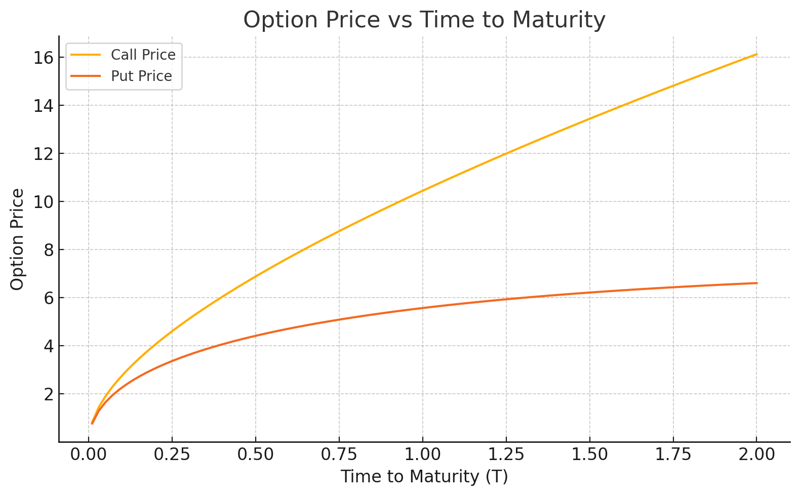
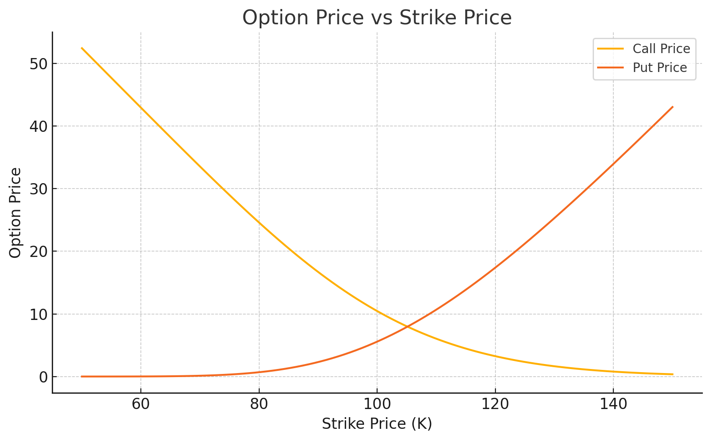

# Black-Scholes Option Pricing Model Implementation
A comprehensive Python-based implementation of the Black-Scholes Option Pricing Model with analytical tools and visualizations for European options.
## 📋 Table of Contents ##

- Overview<br>
- Features<br>
- Installation<br>
- Usage<br>
- Mathematical Background<br>
- Examples<br>
- Contributing<br>
- License

## 📌 Overview

The **Black-Scholes** Analysis project is a Python-based implementation of one of the most influential models in financial mathematics: the Black-Scholes-Merton model. Developed in 1973 by Fischer Black, Myron Scholes, and Robert Merton, this model revolutionized the pricing of European-style options and laid the foundation for modern quantitative finance.

This repository provides a structured, intuitive, and extensible platform to understand and apply the Black-Scholes model in practice. It not only calculates theoretical prices for European call and put options but also explores and analyses how these prices varry with respect to various market parameters such as volatility, interest rate, time to maturity, and strike price.

By leveraging Python’s scientific ecosystem, particularly libraries like NumPy, SciPy, and Matplotlib, the project offers:

- A clear, conceptual, and concise implementation of the core mathematical formulas.

- Analytical tools to study the behavior of options under different conditions.

- Visualization modules that permit users to graphically interpret and analyse option sensitivity.

- A framework that can be easily expanded to include advanced topics such as:

   - Option Greeks (Delta, Gamma, Vega, Theta, Rho)

   - Implied volatility estimations

   - Real-world option data ingestion

   - Monte Carlo simulations (for future versions)

This project is designed for:

- Quant enthusiasts, seeking a deeper and clear understanding of derivative pricing.

- Quantitative analysts and finance folks who want a quick tool for modeling.

- Researchers and developers building and modeling financial applications or trading strategies.

By outlining and explaining both theoretical depth and practical code, this repository bridges the gap between academic finance and real-world quantitative modeling.

## ✨ Features
Core Functionality

- ✅ Accurate computation of European Call and Put options using Black-Scholes formula.
- 📉 Sensitivity analysis using volatility, time, and risk-free rate as dynamic variables.
- 📊 Graphical visualization using Matplotlib and Seaborn.
- 📊 Pandas DataFrame integration for organized output
- 🔢 NumPy and SciPy for mathematical computations
- 🛡️ Robust error handling and input validation
- 📈 Support for both call and put options
- ⚙️ Modular structure with clear separation of logic, computation, and visuals.
- 🧠 Theoretical explanations embedded in code comments for learning and reference.
- 🔄 Easily extendable to include:
  - Option Greeks (Delta, Gamma, Vega, Theta, Rho)
  - Implied Volatility estimation
  - American option approximation
  - Monte Carlo Simulations

## ⚙️ Installation

Clone the repository and install required dependencies:

```bash
git clone https://github.com/Alqama-svg/Black-Scholes-Analysis.git
cd Black-Scholes-Analysis
pip install -r requirements.txt

Dependencies include:

- numpy

- scipy

- matplotlib

- seaborn

Ensure Python 3.7 or higher is installed.
```

## 🚀 Usage<br>
You can run the scripts directly to compute option prices:

```bash
python black_scholes.py
```

## Or use the functions in your own scripts:
```bash
from black_scholes import black_scholes_call, black_scholes_put

call_price = black_scholes_call(S=100, K=110, T=1, r=0.05, sigma=0.2)
put_price = black_scholes_put(S=100, K=110, T=1, r=0.05, sigma=0.2)
```

## You can also visualize option behavior using:
```bash
print(f"Call Option Price: {call_price}")
print(f"Put Option Price: {put_price}")
```

## 📚 Mathematical Background


The Black-Scholes-Merton model is one of the foundational models in quantitative finance. It provides a theoretical estimate of the price of European-style call and put options, assuming that the price of the underlying asset follows a **geometric Brownian motion** with constant volatility and interest rate.

The model assumes the following stochastic differential equation for the underlying asset price `S`:

    dS = μSdt + σSdz

Where:
- `μ` is the expected return of the asset,
- `σ` is the volatility (standard deviation of returns),
- `dz` represents a standard Wiener process (Brownian motion).


Under the risk-neutral measure, the Black-Scholes formula for the price of a **European Call Option** is:

    Call Price (C) = S * N(d1) - K * e^(-rT) * N(d2)

For a **European Put Option**, the formula is:

    Put Price (P) = K * e^(-rT) * N(-d2) - S * N(-d1)

Where:
- `S` = Current price of the underlying asset
- `K` = Strike price
- `T` = Time to expiration (in years)
- `r` = Risk-free interest rate (annualized)
- `σ` = Volatility of the underlying asset
- `N(x)` = Cumulative distribution function (CDF) of the standard normal distribution

And `d1` and `d2` are calculated as:

    d1 = [ ln(S / K) + (r + σ² / 2) * T ] / (σ * √T)
    d2 = d1 - σ * √T


### Key Assumptions of the Black-Scholes Model:
- The market is frictionless (no taxes or transaction costs).
- No arbitrage opportunities.
- The asset pays no dividends during the option's life.
- Volatility and interest rates are constant.
- The underlying follows a continuous geometric Brownian motion.
- Options can only be exercised at expiration (European-style).


The results of the Black-Scholes model form the basis for pricing and hedging strategies in options markets and remain widely used in theoretical and practical finance today.

---

### 🧮 Option Greeks – Formulas

---

The following table summarizes the formulas for the primary option Greeks under the Black-Scholes model. These represent the sensitivities of the option price to various market variables.

| Greek     | Call Option Formula                                              | Put Option Formula                                               |
|-----------|------------------------------------------------------------------|------------------------------------------------------------------|
| **Delta (Δ)** | N(d₁)                                                           | N(d₁) - 1                                                        |
| **Gamma (Γ)** | φ(d₁) / (S₀ × σ × √T)                                         | φ(d₁) / (S₀ × σ × √T)                                            |
| **Vega (ν)**  | S₀ × φ(d₁) × √T                                               | S₀ × φ(d₁) × √T                                                  |
| **Theta (Θ)** | -[S₀ × φ(d₁) × σ / (2√T) + r × K × e^(–rT) × N(d₂)]           | -[S₀ × φ(d₁) × σ / (2√T) – r × K × e^(–rT) × N(–d₂)]             |
| **Rho (ρ)**   | K × T × e^(–rT) × N(d₂)                                       | –K × T × e^(–rT) × N(–d₂)                                        |

> Where:
> - `N(x)` is the cumulative distribution function (CDF) of the standard normal distribution  
> - `φ(x)` is the probability density function (PDF) of the standard normal distribution  
> - `S₀` is the current stock price  
> - `K` is the strike price  
> - `T` is time to maturity  
> - `r` is the risk-free rate  
> - `σ` is volatility  
> - `d₁` and `d₂` are as defined in the Black-Scholes model


---

## 🗂️ Code Structure


```bash
Black-Scholes-Analysis/
│
├── black_scholes.py         # Core implementation of pricing functions
├── visualizations.py        # Parameter sensitivity graphs and heatmaps
├── requirements.txt         # Python dependencies
├── README.md                # Project documentation
└── examples/                # Sample use-cases and notebooks (optional)
```

---

## 🔍 Examples
### Option Price vs Volatility

This graph illustrates how call and put **option prices** increase with market **volatility**.

```bash
from black_scholes import black_scholes_call, black_scholes_put

call = black_scholes_call(S=120, K=100, T=0.5, r=0.03, sigma=0.25)
put = black_scholes_put(S=120, K=100, T=0.5, r=0.03, sigma=0.25)
```

---


### Option Price vs Time to Maturity

Options gain value as time to expiry increases.

```bash
from visualizations import plot_option_price_vs_volatility

plot_option_price_vs_volatility(S=100, K=90, T=1, r=0.05)
```

### Option Price vs Strike Price

Shows how call prices drop and put prices rise as the strike diverges from the spot price.

```bash
from visualizations import plot_price_vs_strike

plot_price_vs_strike(S=100, T=1.0, r=0.05, sigma=0.2)
```

## 📑 API Reference

### `black_scholes_call(S, K, T, r, sigma)`
Returns the price of a European call option.

**Parameters:**
- `S` *(float)*: Current stock price
- `K` *(float)*: Strike price
- `T` *(float)*: Time to maturity in years
- `r` *(float)*: Annual risk-free interest rate (in decimal form, e.g., 0.05)
- `sigma` *(float)*: Volatility of the underlying asset (in decimal form, e.g., 0.2)

**Returns:**
- *(float)*: Theoretical call option price.

---

### `black_scholes_put(S, K, T, r, sigma)`
Returns the price of a European put option.

**Parameters:**
- `S` *(float)*: Current stock price
- `K` *(float)*: Strike price
- `T` *(float)*: Time to maturity in years
- `r` *(float)*: Annual risk-free interest rate
- `sigma` *(float)*: Volatility of the underlying asset

**Returns:**
- *(float)*: Theoretical put option price.

---


### `plot_option_price_vs_volatility(S, K, T, r)`
Generates a line plot showing how the option price varies with changes in volatility.

**Parameters:**
- `S` *(float)*: Current stock price
- `K` *(float)*: Strike price
- `T` *(float)*: Time to maturity in years
- `r` *(float)*: Annual risk-free interest rate

---


## 🤝 Contributing

Contributions are **highly appreciated**!

If you'd like to enhance the model, improve documentation, or introduce new visualizations or features:

1. **Fork** the repository.
2. **Create a new branch**:
   ```bash
   git checkout -b feature-name
   ```
3. **Make your changes**, then commit:

```bash
git commit -am 'Add new feature'
```
4. **Push to your branch:**

```bash
git push origin feature-name
```

5. **Open a Pull Request** and describe your changes.

Please follow these guidelines:

- Maintain consistent coding style (PEP8 for Python).

- Include comments and documentation where needed.

- Ensure your code runs without errors before submission.

Let’s build something great together!


## 📄 License

This project is licensed under the MIT License. You are free to use, modify, and distribute this code for educational and commercial purposes with attribution.

---

## ✅ Conclusion

The **Black-Scholes-Analysis** repository brings together mathematical elegance and practical implementation to serve as a foundational toolkit for understanding European option pricing. Whether you're a finance student exploring the world of quantitative models or a developer prototyping algorithmic strategies, this project provides the building blocks for accurate and scalable derivative pricing.

By encapsulating the core Black-Scholes equations into a clean Python API with supporting visualizations, this project bridges the often wide gap between financial theory and engineering application. Its modular design also opens the door for advanced enhancements like option Greeks, implied volatility estimators, Monte Carlo simulations, or real-time data integration.

This project is more than just a numerical calculator — it's a stepping stone toward deeper exploration in financial engineering, algorithmic trading, and mathematical modeling.

> If this repository helped you understand the Black-Scholes model better or served as a starting point in your quant journey, consider starring ⭐ the project, contributing, or sharing it with others.

Thank you for visiting and happy modeling!
